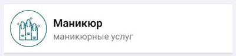
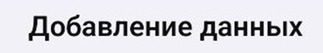
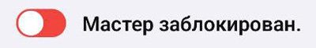
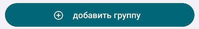
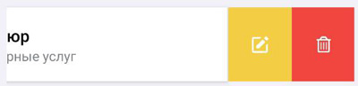
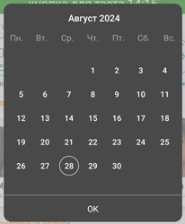
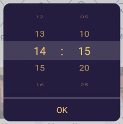

## Карточки

>MasterCart

>DepartmentCart

>ServiceCart

>DepartmentCartAdmin

## Текст

>Title

 

>Discription

 

## Меню

>MenuItem

## Кнопки

>Switcher

>ButtonWithIcon

## Widget

>ButtonSwipeable

>BottomModalSheet

>AnimatedHeaderUser

>QuestionHOC

>Calendar

>Clock

